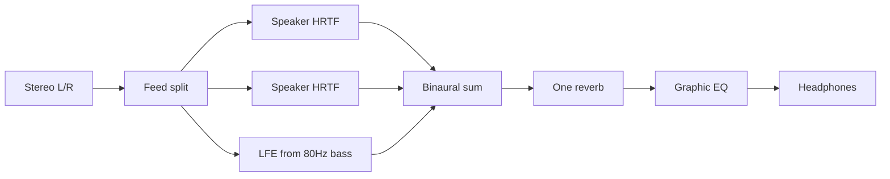

# 多音响 / virtual loudspeakers — v1 spec

> Design-before-code. **Do not treat this as landed.**  
> Complements [`IMPLEMENTATION.md`](./IMPLEMENTATION.md), Live Transfer, and the existing single-source `HrtfStreamer`.  
> Isolation is a hard product requirement: today’s working player must remain the default.

## Isolation (do not regress)

**一定不要影响现在的工程。** Multi-speaker is an additive mode, default **off**.

| Must stay as today | How v1 stays out of the way |
|--------------------|-----------------------------|
| Point-source Mid + envelopment ±110° | `render_mode = Point` is default. Array is a **sibling branch**, not a rewrite of `process_chunk` |
| Live WASAPI process loopback, sticky Transfer, source-follow pin to muted speakers | Same capture/output path. Virtual speakers are **not** extra WASAPI devices |
| `YinweiParamsC` field layout | **Do not extend** that struct. Array uses **new FFI** (same pattern as `yinwei_set_eq` / `yinwei_live_set_eq`) |
| Old `spatial_core.dll` without array symbols | Array UI hidden; file Spatial + Live point-source still work |
| Pose slew, dual-xfade, orbit 8° HRIR step | Reuse per-speaker when a speaker moves; do not retune globals |
| 80 Hz bass bypass, EQ after heard stereo | Unchanged. LFE speaker taps the existing bass bus — no extra HRTF |
| Never mute source app sessions; never `pid=0` device loopback | Unchanged |

**Forbidden while implementing:** “while we’re here” refactors of envelopment, Live queues, SMTC daemon, or `HrtfStreamer` Point path.

Regression floor (listen in Full, not Island): 汽水 Transfer, source switch without dry+wet stack, lipsync not back to >300 ms, Full now-playing = SMTC title/progress, PID = `SodaMusic` MAIN for 汽水 AUMID `汽水音乐`.

## Goal

User can simulate a loudspeaker array around the listener: add speakers at arbitrary az/el/dist, feed them from the **same** stereo stream, render each through the existing HRTF, mix to headphone stereo.

v1 is **discrete virtual speakers on headphones**, not Ambisonics, not a room IR, not hardware 7.1.

## Approach

Two mutually exclusive render modes:

```text
Point  (default)  = today’s Mid HRTF + envelopment ±110° ambient + orbit
Array             = N discrete speakers; envelopment forced unused (lock 0)
```

File playback and Live Transfer share **one** `Layout` object (same sharing as today’s one `SpatialParams` pose).



One `HrtfStreamer` instance (playback and live each keep one). Inside: `Vec<SpeakerState>` with per-speaker HRIR `prev` history + pose slew. Shared: crossover, one reverb, air/distance, EQ.

CPU budget (48 kHz, `STREAM_CHUNK` 512): mute skips convolution; only the **dragged** speaker dual-xfades; whole-layout preset change uses a short fade — never swap 7 HRIRs in one callback. Live wet/dry queues stay ~4 chunks. **Do not add latency padding for array quality.**

## Data model

```
Speaker {
  id,          // stable, for select / undo
  label,       // "L" / "Rs" / "自定义 3"
  az_deg,      // [-180, 180]; 0° front, +90° right (same as today)
  el_deg,      // [-90, 90]
  dist_m,      // [0.5, 10]; existing gain + air curve
  gain_db,     // [-12, +6]
  mute,
  feed         // Left | Right | Mid | Lfe
}

Layout {
  name,        // "Stereo 2.0" / "ITU 5.1" / "Custom"
  speakers[]   // 2…8
}
```

Feed from the single stereo input (not VBAP, not dual-mono to every speaker):

| feed | Mono sent into that speaker’s HRTF |
|------|--------------------------------------|
| Left | `L` |
| Right | `R` |
| Mid | `(L+R)/2` at about −3 dB |
| Lfe | Existing 80 Hz bass, **no HRTF**, `gain` into both ears |

Presets (ITU angles, public; do **not** copy HeSuVi/Dolby IR wavs):

- **2.0:** L −30° `Left`, R +30° `Right`
- **5.1:** + C 0° `Mid`, Ls/Rs ±110°. Surrounds = attenuated same-side channel. v1: **no** extra surround delay (Live lipsync budget). LFE from bass bus.
- **7.1:** sides ±90° + rears ±135° (this set is locked in v1). Rears weaker than sides.

Custom add: click empty orbit → `feed=Mid`, `el=0`, `dist=1.5 m`, `gain=0 dB`. Never default dual-mono on all speakers (that is fake reverb, worse than envelopment).

## Engine (when coding later)

- Point path in `hrtf_render.rs` **untouched**.
- Array: new branch / helper called only when `render_mode == Array`.
- New FFI (names indicative): `yinwei_set_layout` / `yinwei_live_set_layout` taking a compact blob or speaker count + arrays. Missing symbol → Dart treats array as unavailable.
- Export WAV uses the same layout when Array is on.
- Continue `hrtf` crate 0.8 + embedded `IRC_1002_C.bin`. No SOFA in v1.

## UI (when coding later)

- **Full only:** `orbit_visualizer.dart` multiple dots; selected speaker in `position_sidebar.dart` (az/el/dist/gain/mute/feed); “+” to add.
- Layout chips: 2.0 / 5.1 / 7.1 / 自定义. Point-mode 3×3 Front/Left/Right… presets stay for Point.
- **Island:** layout name only. No add/mute on the pill.
- Keep existing ~32 ms param throttle. Do not send a full 8-speaker JSON every visualizer frame.

## Implementation order (code is a later pass; this doc is not a build)

1. Layout types + new FFI; Array forces envelopment unused; Point default.
2. Streamer N-path + **2.0** listen baseline (A/B vs Point Right 90°).
3. Two dots draggable on the orbit ball.
4. 5.1 + LFE rule + sidebar selection.
5. Custom add/remove, cap 8.
6. Only then 7.1 and optional whole-array orbit.

**No build in the spec pass.** Do not run `cargo`, `flutter run`, or `build_native_windows.ps1` until the user authorizes a build.

## Files (spec now; code later)

| File | Later change |
|------|----------------|
| `crates/spatial_core/src/hrtf_render.rs` | Array branch beside Point; do not rewrite envelopment |
| `crates/spatial_core/src/ffi.rs` | New layout FFI; leave `YinweiParamsC` stable |
| `crates/spatial_core/src/live_transfer.rs` | Apply layout via existing single streamer |
| `apps/.../models/spatial_params.dart` | Optional Layout; default Point |
| `apps/.../widgets/orbit_visualizer.dart` | N dots when Array |
| `apps/.../widgets/position_sidebar.dart` | Layout chips + selected speaker |
| `docs/IMPLEMENTATION_MULTI_SPEAKER.md` | This spec |

## Pass criteria (when a later code pass is authorized)

1. Default boot: Point source + Live Transfer behave as the GitHub backup snapshot (no array).
2. Array 2.0 is audibly different from Point +90°.
3. 5.1 does not boom (LFE not HRTF’d).
4. Live lipsync does not regress to >300 ms.
5. Source-follow / no source-app mute / no `pid=0` loopback still hold.
6. `cargo test` / Flutter tests for new types only after build is authorized.

## Non-goals

- Room IR / BRIR / geometric reverb (that is a recorded room, not “place a speaker”)
- Physical multi-device WASAPI, Windows 7.1 endpoint, Equalizer APO / HeSuVi
- One loopback PID per speaker
- Ambisonics / Resonance-style virtual sphere replacing discrete HRTF
- Custom SOFA / second HRIR set
- 7.1.4 / Atmos height presets (custom `el` is enough)
- Per-speaker EQ or per-speaker reverb
- Using array to “fix” dry+wet overlay or Bluetooth HFP 通话音质
- Linking GPL (CamillaDSP, SPARTA GUI, HeSuVi IR, IEM) into `spatial_core`

## Read-only references (do not vendor)

- [SPARTA Binauraliser](https://github.com/leomccormack/SPARTA) / [SAF](https://github.com/leomccormack/Spatial_Audio_Framework) — N × HRTF → stereo mix (GPL/ISC: topology only)
- HeSuVi / PipeWire 7.1 convolver — layout presets (GPL + often non-redistributable IRs)
- [3D Tune-In Toolkit](https://github.com/3DTune-In/3dti_AudioToolkit) — N direct HRTF + **one** shared reverb
- Existing [`hrtf`](https://github.com/mrDIMAS/hrtf) crate (MIT) already in tree
- [Resonance Audio](https://github.com/resonance-audio/resonance-audio) — **not** v1; Ambisonics hides user-placed speakers
