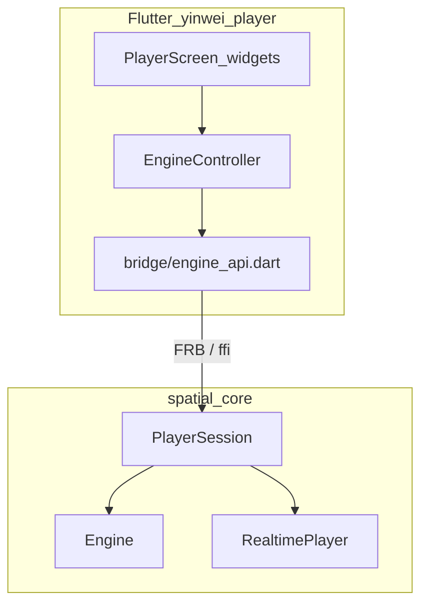

# P2 Implementation — Flutter ↔ Rust 桥接

> **铁律**：本文件评审/锁定后才改代码。  
> 上级计划：[`IMPLEMENTATION_PHASES.md`](./IMPLEMENTATION_PHASES.md)  
> UI/引擎契约：[`IMPLEMENTATION.md`](./IMPLEMENTATION.md)  
> Mockup：桌面 `assets/ui-mockup.jpg` · 手机 `assets/ui-mockup-mobile.jpg`

---

## 1. 目标（本段唯一验收）

Windows 上（或本机有声卡时）Flutter 播放器：

1. **Open** 本地音频  
2. **Play / Pause / Seek** 走 Rust（Spatial 或 Original）  
3. 改 **音位 / Fixed|Orbit / 滑杆** → 重渲预览后继续听  
4. **Export WAV** 选路径写出  
5. 轨道球读 `currentAzimuthDeg`  

云端无 Flutter / 无声卡：**Rust Session API + Dart 接线 + 契约测试**必须绿；完整 GUI 听感在 Windows 验收。

---

## 2. 架构



**不在本段**：P3 安装包、流式边解边渲、自定义 SOFA。

---

## 3. 子段拆分

| 子段 | 交付 | 验收 |
|------|------|------|
| **P2.0** | 本文档锁定 | 评审通过后再写代码 |
| **P2.1** | Rust `PlayerSession` 统一 open/play/params/export | `cargo test` Session 路径 |
| **P2.2** | FRB 可暴露的纯函数 / 类型镜像 | 与 Dart 模型字段一致 |
| **P2.3** | Dart `EngineController` + UI 接线 | 无 native 时可用 `MockEngine`；有 native 切 `NativeEngine` |
| **P2.4** | `flutter_rust_bridge` 工程脚手架 | `flutter_rust_bridge.yaml` + Rust `api` 入口；Windows 上 codegen |
| **P2.5** | 打开/导出文件选择器 + 进度 UI | 与样图 Export / Open 一致 |

执行顺序：**P2.0 → P2.1 → P2.2 → P2.3 → P2.4 → P2.5**。

---

## 4. Rust API（P2.1 / P2.2）

新建 `PlayerSession`（线程安全，`Arc`），内部持有 `Engine` + `RealtimePlayer`。

### 4.1 生命周期

```
create() → open(path) → set_params / set_mode / apply_preset
         → rebuild_preview()   # render_frames + load_frames
         → play() / pause() / seek_ms()
         → export_wav(path, progress)
         → dispose()
```

参数变更（音位、motion、envelopment、reverb、mode）标记 `preview_dirty`。  
`play()` 若 dirty：先 `rebuild_preview()` 再播。

### 4.2 对外方法（FRB 表面）

| 方法 | 输入 | 输出 | 说明 |
|------|------|------|------|
| `session_create` | — | handle / unit singleton | 本段用进程内单例亦可 |
| `session_open` | `path: String` | `TrackInfoDto` | 解码失败抛错 |
| `session_set_params` | `SpatialParamsDto` | — | validate |
| `session_apply_preset` | `PositionPresetDto` | `SpatialParamsDto` | |
| `session_set_mode` | `original \| spatial` | — | dirty |
| `session_rebuild_preview` | progress cb? | — | 可能较慢，Isolate/async |
| `session_play` | — | — | 无设备 → 可识别错误码 |
| `session_pause` | — | — | |
| `session_seek_ms` | `u64` | — | |
| `session_position_ms` | — | `u64` | |
| `session_is_playing` | — | `bool` | |
| `session_current_azimuth_deg` | — | `f32` | 可视化 |
| `session_export_wav` | `path` + progress | — | |
| `session_dispose` | — | — | 停流 |

### 4.3 DTO（与 Dart `spatial_params.dart` 对齐）

```
TrackInfoDto { title, artist, album, durationMs, sampleRate, channels, path }
SpatialParamsDto {
  azimuthDeg, elevationDeg, distanceM,
  motion: fixed|orbit, orbitHz, envelopment, reverbMix,
  selectedPreset: enum?
}
PlaybackModeDto { original, spatial }
PositionPresetDto { front, leftFront, ... overhead }  // 与 UI 九宫格一致
```

Serde `camelCase`；Dart 侧同名。

### 4.4 错误映射

| Rust | Dart / UI |
|------|-----------|
| `FileNotFound` | SnackBar：文件不存在 |
| `Decode` | 无法解码 |
| `InvalidParam` | 参数非法 |
| `AudioDevice` | 可播放缓冲已就绪，提示无输出设备 |
| `NoTrackLoaded` | 请先打开文件 |

---

## 5. Dart / Flutter（P2.3 / P2.5）

### 5.1 文件

| 路径 | 职责 |
|------|------|
| `lib/bridge/engine_api.dart` | 抽象接口（保持稳定） |
| `lib/bridge/mock_engine.dart` | 无 native 时的行为模拟（进度/假时长） |
| `lib/bridge/native_engine.dart` | 调用 FRB 生成代码（P2.4 后填满） |
| `lib/state/engine_controller.dart` | ChangeNotifier：轨元数据、params、playing、progress、dirty |
| `lib/screens/player_screen.dart` | 绑定 Controller，去掉纯 demo 逻辑 |
| `lib/widgets/*` | 只收回调/状态，不直接碰 FFI |

### 5.2 `EngineApi` 最终签名（锁定）

```dart
abstract class EngineApi {
  Future<TrackMeta> open(String path);
  Future<void> setParams(SpatialParams params);
  Future<SpatialParams> applyPreset(PositionPreset preset);
  Future<void> setPlaybackMode(PlaybackMode mode);
  Future<void> rebuildPreview({void Function(double)? onProgress});
  Future<void> play();
  Future<void> pause();
  Future<void> seek(Duration position);
  Future<Duration> position();
  Future<bool> isPlaying();
  Future<double> currentAzimuthDeg();
  Future<void> exportWav(String outPath, {void Function(double)? onProgress});
  Future<void> dispose();
}
```

### 5.3 UI 事件映射

| UI | Controller |
|----|------------|
| 文件夹 Open | `file_picker` → `open` → `rebuildPreview` |
| Play/Pause | `play` / `pause` |
| Seek 滑条 | `seek` |
| Original \| Spatial | `setPlaybackMode` + dirty → 下次 play 重渲 |
| 音位芯片 / 滑杆 / Fixed\|Orbit | `setParams` / `applyPreset`，dirty=true |
| Export WAV | 选路径 → `exportWav` + 进度条 |
| OrbitVisualizer | 定时读 `currentAzimuthDeg`（playing 时） |

### 5.4 进度 UX

- `rebuildPreview` / `exportWav`：全屏或底部线性进度（0–1）。  
- 导出中禁用 Play/参数，避免状态撕裂。

---

## 6. FRB 脚手架（P2.4）

### 6.1 布局

```
yinwei/
  crates/spatial_core/src/
    session.rs          # PlayerSession
    frb_api.rs          # #[frb] 入口（薄封装 session）
  apps/yinwei_player/
    flutter_rust_bridge.yaml
    rust/               # 可选：workspace 成员指向 spatial_core
    lib/bridge/frb/     # 生成物目录（gitignore 生成文件或提交）
```

### 6.2 策略（本环境无 Flutter）

1. **先手写** `PlayerSession` + Dart `EngineApi`/`NativeEngine` 占位。  
2. Windows 开发机执行：

```bash
# 需 Flutter + flutter_rust_bridge_codegen
cd yinwei/apps/yinwei_player
flutter_rust_bridge_codegen generate
flutter run -d windows
```

3. 生成后 `NativeEngine` 改为调用 `FrbEngine`；`MockEngine` 保留给 CI/预览。

### 6.3 构建

- `spatial_core` `cdylib` 已有 → Windows 产出 `spatial_core.dll`。  
- Flutter 通过 FRB 加载；P3 再处理安装路径。

---

## 7. 测试计划

| 层级 | 内容 |
|------|------|
| Rust | Session：open → set preset → render_frames 非空；export 写文件；seek 边界 |
| Dart（分析） | `dart analyze`（有 SDK 时）；Controller 单测可选 |
| 手工 Windows | 打开 MP3 → Spatial → Left Rear → 听 → Export → 用系统播放器核对 |

---

## 8. 明确不做（P2）

- 修改已锁定样图布局（除非 bug）  
- 汽水/网易云/LX 音源  
- iOS/Android 打包（仅保持 API 可移植）  
- P3 安装器  

---

## 9. 开工检查清单（写码前勾选）

- [x] P2 目标与验收写清  
- [x] Session API / DTO / 错误表写清  
- [x] Dart 文件与 UI 事件映射写清  
- [x] FRB 脚手架与无 Flutter 环境策略写清  
- [x] **P2.1 代码开工**（PlayerSession）  
- [x] **P2.3** EngineController + PlayerScreen 接线（MockEngine）  
- [x] **P2.4** C ABI + dart:ffi NativeEngine（见 [`IMPLEMENTATION_P2_4.md`](./IMPLEMENTATION_P2_4.md)）  
- [ ] P2.5 导出路径选择器打磨（Open 已用 file_picker）  
- [ ] Windows 本机验听：`tools/build_native_windows.ps1` + 耳机  

---

## 10. 状态

| 项 | 状态 |
|----|------|
| P2.0 本文档 | **已锁定** |
| P2.1 PlayerSession | **已实现** |
| P2.2 / frb_api | **已实现薄封装** |
| P2.3 Dart Controller + UI | **已接线** |
| P2.4 Native bridge | **C ABI + dart:ffi**（FRB yaml 保留可选） |
| P2.5 文件选择器 | Open 已接；Export 默认 Downloads |
